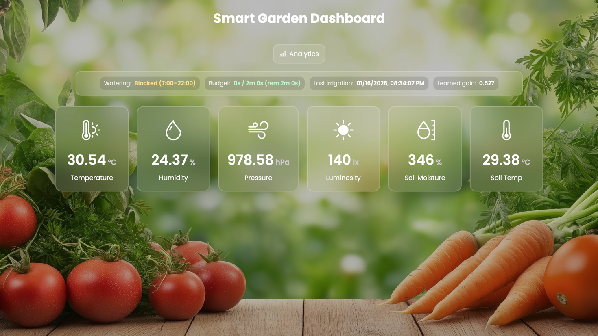

# 🌱 SmartGarden



**SmartGarden** is an adaptive, sensor-driven garden automation system designed to monitor environmental conditions, make intelligent control decisions, and continuously improve its behavior over time.

The system runs on a **Raspberry Pi**, integrates real hardware sensors and actuators, and exposes a **live web dashboard** with analytics and explainability.  
A full **mock mode** is supported for development and testing without physical hardware.

---

## ✨ Key Features

- 📡 Real-time sensor ingestion  
  *(temperature, humidity, light, soil moisture, pressure)*  
- 🧠 Decision engine with explainable reasoning  
- 🚰 Automated irrigation with safety & timing constraints  
- 💡 Automated lighting control  
- 📈 Historical analytics & visual dashboards  
- 🔁 Feedback-based learning & calibration jobs  
- 🧪 Full mock mode for development & CI  
- 🌐 Web dashboard (FastAPI + HTML/JS)  
- 🗄️ SQLite persistence (portable & lightweight)  

---

## 🧠 Design Philosophy

SmartGarden is built around a few core principles:

- **Separation of concerns**  
  Sensing, decision-making, actuation, storage, and presentation are cleanly decoupled.
- **Explainability over black-box automation**  
  Every control decision can be inspected and reasoned about.
- **Hardware-agnostic development**  
  Mock readers and actuators allow rapid iteration without Raspberry Pi access.
- **Incremental intelligence**  
  The system improves via calibration, historical feedback, and tunable constraints.

---

## 🧩 High-Level Architecture

```text
┌──────────────┐
│ Sensors      │  (Pi / Mock)
└──────┬───────┘
       ↓
┌──────────────┐
│ SensorReader │
└──────┬───────┘
       ↓
┌──────────────┐
│ Scheduler    │  ← control loop
└──────┬───────┘
       ↓
┌──────────────┐
│ ControlEngine│
└──────┬───────┘
       ↓
┌──────────────┐
│ Actuator     │  (Pump / Light)
└──────┬───────┘
       ↓
┌──────────────┐
│ SQLite DB    │
└──────┬───────┘
       ↓
┌──────────────┐
│ Web UI       │
└──────────────┘

```

## Folder structure (quick view)

```
smartgarden/
├── .env # Environment variables (local / Raspberry Pi)
├── .env.example # Example environment config
├── README.md # Project documentation
├── requirements.txt # Python dependencies
├── pyproject.toml # Project metadata
├── run.py # Main entry point (starts scheduler loop)
├── run_test.py # Optional test runner
├── data/
│ └── smartgarden.db # SQLite database (created at runtime)
└── src/
└── smartgarden/
├── actuation/
│ ├── init.py
│ └── mock_actuator.py # Development (simulated) actuator
│
├── control/
│ ├── init.py
│ ├── engine.py # Core decision engine
│ └── constraints.py # Safety & timing constraints
│
├── hardware/
│ ├── pi_reader.py # Raspberry Pi sensor reader
│ └── pi_actuator.py # Raspberry Pi GPIO actuator
│
├── models/
│ ├── init.py
│ └── types.py # Shared dataclasses & enums
│
├── sensing/
│ ├── init.py
│ └── mock_reader.py # Development (simulated) sensor reader
│
├── services/
│ ├── init.py
│ └── scheduler.py # Main control loop orchestration
│
├── storage/
│ ├── init.py
│ ├── sqlite_repo.py # SQLite persistence & analytics queries
│ └── schema.py # (Optional) schema helpers
│
├── web/
│ ├── app.py # FastAPI application setup
│ ├── api.py # Dashboard API endpoints
│ ├── analytics_api.py # Analytics API endpoints
│ ├── routes.py # Page routing
│ ├── templates/
│ │ ├── index.html # Dashboard UI
│ │ └── analytics.html # Analytics UI
│ └── static/
│ ├── css/
│ │ └── style.css
│ ├── js/
│ │ ├── script.js
│ │ └── analytics.js
│ └── images/
│ └── background8.png
│
└── config.py # Centralized settings loader
```
----


## ⚙️ Configuration

SmartGarden uses environment variables for configuration.

Create a `.env` file from the example:

```bash
cp .env.example .env
```

### Example Environment Variables

```env
MODE=mock                 # mock | hardware
DB_PATH=data/smartgarden.db
SENSOR_INTERVAL_SEC=30
ENABLE_WEB=true
```

---

## ▶️ Running SmartGarden

### 1️⃣ Install dependencies

```bash
pip install -r requirements.txt
```

### 2️⃣ Run in **mock mode** (no hardware required)

```bash
python run.py
```

Mock sensors and actuators will simulate readings and actions.

### 3️⃣ Run on **Raspberry Pi hardware**

1. Set the mode in `.env`:
   ```env
   MODE=hardware
   ```

2. Ensure GPIO pins and sensors are properly connected

3. Run:
   ```bash
   python run.py
   ```

---

## 🌐 Web Dashboard

When enabled, the FastAPI server exposes:

- Live sensor readings
- Control decisions with explanations
- Historical analytics & charts

**Default URL:**

```text
http://localhost:8000
```

---

## 🧪 Testing & Development

- Mock readers & actuators allow safe local development
- Core logic is fully testable without GPIO access
- Designed to support future unit & integration tests

---

## 🚀 Future Enhancements

- 📷 Camera-based plant health detection
- 🤖 ML-based adaptive watering models
- ☁️ Cloud sync & remote monitoring
- 📱 Mobile-friendly dashboard
- 🌱 Multi-zone & multi-plant support
